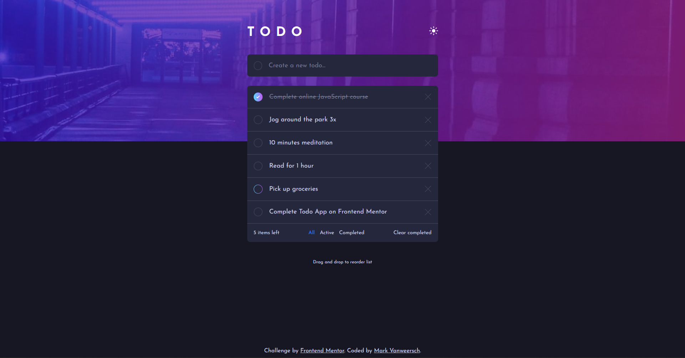
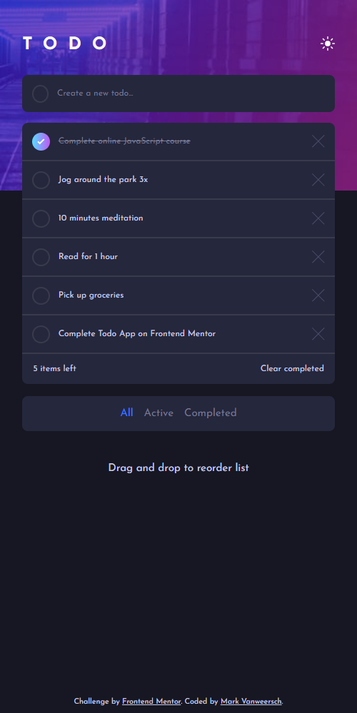

# Frontend Mentor - Todo app solution

This is a solution to the [Todo app challenge on Frontend Mentor](https://www.frontendmentor.io/challenges/todo-app-Su1_KokOW). Frontend Mentor challenges help you improve your coding skills by building realistic projects. 

## Table of contents

- [Overview](#overview)
  - [The challenge](#the-challenge)
  - [Screenshot](#screenshot)
  - [Links](#links)
- [My process](#my-process)
  - [Built with](#built-with)
  - [What I learned](#what-i-learned)
  - [Continued development](#continued-development)
  - [Useful resources](#useful-resources)
- [Author](#author)
- [Acknowledgments](#acknowledgments)

## Overview

### The challenge

Users should be able to:

- View the optimal layout for the app depending on their device's screen size
- See hover states for all interactive elements on the page
- Add new todos to the list
- Mark todos as complete
- Delete todos from the list
- Filter by all/active/complete todos
- Clear all completed todos
- Toggle light and dark mode
- **Bonus**: Drag and drop to reorder items on the list

### Screenshot

Desktop:

Mobile:

### Links

- Solution URL: [FrontendMentor.io](https://www.frontendmentor.io/solutions/todo-app-using-flexbox-and-vanilla-js-with-drag-and-drop-feature-lyAHSN0mvs)
- Live Site URL: [MarkVanweersch.GitHub.io](https://markvanweersch.github.io/todo-app/)

## My process

### Built with

- CSS Custom Properties
- CSS Flexbox
- Semantic HTML
- Vanilla JS

### What I learned

I learned more about creating HTML elements with JS and adding them to the DOM.

I also learned about dragging and dropping elements with JS, thanks to Web Deb Simplified on YouTube. I coded along with the video, trying to understand what was happening during each section.

### Continued development

The reduce method I want to understand better. I know how it works, but in the drag and drop function it gets quite complicated, using an object as the base value.

### Useful resources

- [Youtube.com](https://www.youtube.com/watch?v=jfYWwQrtzzY) - This is where the code comes from to make the drag and drop feature. All the credits go to Web Dev Simplified. In the video two containers are used, in the todo app there's only one container, so the code differs just a bit.

## Author

- Website - [MarkVanweersch.GitHub.io](https://markvanweersch.github.io/)
- Frontend Mentor - [@MarkVanweersch](https://www.frontendmentor.io/profile/MarkVanweersch)

## Acknowledgments

A big thank you to Web Dev Simplified for making videos on web development. The drag and drop functionality is his code. The video linked above made me understand how it works.